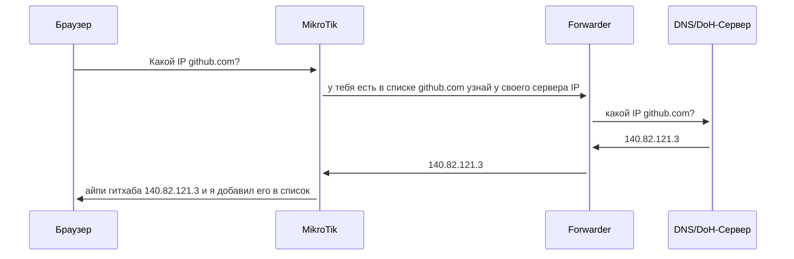

## Введение

Было уже огромное количество постов на тему точечного обхода блокировок на MikroTik. Самым актуальным способом до недавнего времени было получение списка заблокированный подсетей через BGP от сервисам наподобие  antifilter.network и маршрутизация их в VPN. Работало все здорово кроме OpenAI. Используемые мной DNS сервера почти всегда отдавали мне ip, которые не попадали в диапазоны, полученные через BGP. Я начал разбираться, спросил в чате вышеупомянутого сервиса в чем может быть проблема, на что один из участников ответил мне единственным словом из трех букв: "FWD"

## Что я узнал про FWD:

FWD это особый тип DNS-записей в MikroTik позволяет перенаправитиь DNS-запросы для выбранного домена на сервер отличный от основного через Forwarder.
Forwarder в свою очередь это сущность внутри маршрутизатора которая перенаправляет запросы к выбраному классическому DNS или DNS over HTTPS серверу. Бонусом ко всему этому является то что в настройках FWD записи можно указать AddressList куда попадет зарезолвленный форвардером ip. Благодаря этому мы можем внести наши зацензуренные как FWD-записи и они сложаться в список адресов при отправке на них запросов. И то что есть чекбокс, позволяющий включать в этот список все поддомены, достойно отдельной благодарности.



## Как настроить
Добавить DNS Forwarder можно так
```
/ip dns static
forwarders add doh-servers=https://cloudflare-dns.com/dns-query name=cf.dns verify-doh-cert=no
add comment="DNS for FWD" forward-to=cf.dns name=router.dns type=FWD

add address-list=Censored comment=TOR forward-to=router.dns match-subdomain=yes name=\
    torproject.org type=FWD
```


